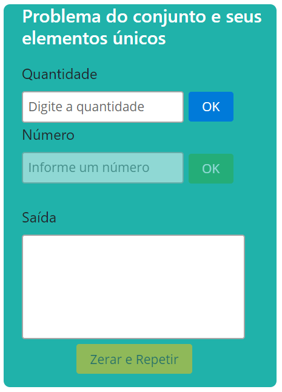
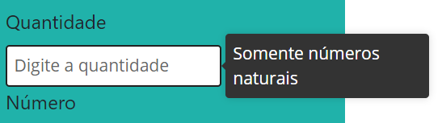
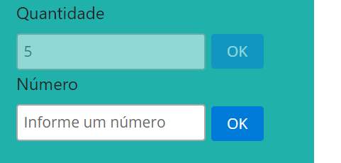
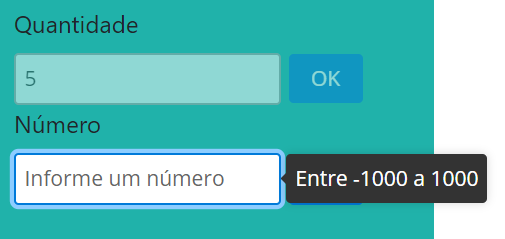
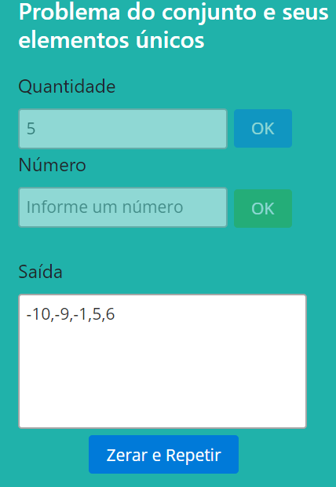

# Projeto desenvolvido em Angular: Problema do conjunto e seus elementos únicos
===

Clone do projeto
----------
```git clone https://github.com/alissonrichardy/Conjunto-elementos-unicos.git```

Screenshots
----------












